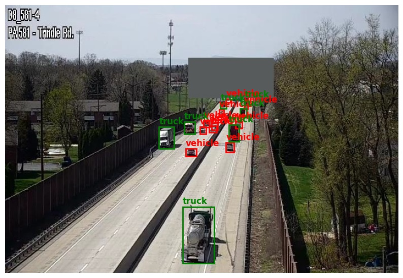

# HighwayCameraDataset
---
This repository shows how to browse and use [Highway Camera Dataset](https://huggingface.co/datasets/PrzemekS/highway-vehicles) available at Hugging Face.

### Citations
If you are using this dataset, consider citing the related paper:

`Placeholder for a paper, will appear as soon as it is published :>`

## Dataset details
This dataset contains sceens from road cameras (mainly highway cameras)
with cars classified into vehicles (class 0), and trucks (class 1). Overall, it contains 3,812 scenes with 91,843 images.
To avoid problems with very small cars, the areas where such cars appear are covered with grey recangles.

 

The detailed data split looks as follows:

#### Total
- Total number of images: 3,812
- Total number of objects: 91,843
- Total objects per class:
    - Class 0 (vehicle): 70,963
    - Class 1 (truck): 20,880

#### Train subset
- Number of images: 3,650
- Number of objects: 86,261
- Objects per class:
    - Class 0 (vehicle): 66,473
    - Class 1 (truck): 19,788

#### Test subset
- Number of images: 162
- Number of objects: 5,582
- Objects per class:
    - Class 0 (vehicle): 4,490
    - Class 1 (truck): 1,092


## Installation
1. Download this repository
2. Create your own conda environment, e.g:
```bash
conda create --name HighwayDataset python=3.11.5
conda activate HighwayDataset
```
3. Install pytorch. This step depends on current pytorch version, CUDA version, etc. Usually, one line of pip install is enough, and you can find it at [Pytorch get started](https://pytorch.org/get-started/locally/) website, under the `Start Locally` section.
4. Install Requirements with:
```bash
pip install -r requirements.txt
```

## Files
- `Browse_hf_dataset.ipnb` - A notebook that helps browsing the dataset.
- `create_yolo_dataset.py` - Code that changes HuggingFace dataset into a format acceptable for [Ultralytics](https://github.com/ultralytics/ultralytics) library.  
- `train_yolo.py` - finetunes `Yolo11n` model.
- `data_config.yaml` - required for yolo training

## How to use it
### Browsing repository
Just run view_hf_dataset.ipynb notebook. Originally it samples `NUM_IMAGES` images and displays them, but it is easy to adjust the code.

### Training YOLO
To train yolo model with this dataset you should:

1. Covert dataset to yolo format with
```bash
python create_yolo_dataset.py
```
2. Train your yolo model with
```bash
python train_yolo.py
```

Currently, it is set on `yolo11n` model, yet any model should work.

## Credits
The dataset was labeled by:
- QingLian He (team leader)
- Binya Zhang
- Amir Noekhan

Code was created by [Przemek Sekula](https://github.com/PrzemekSekula)

